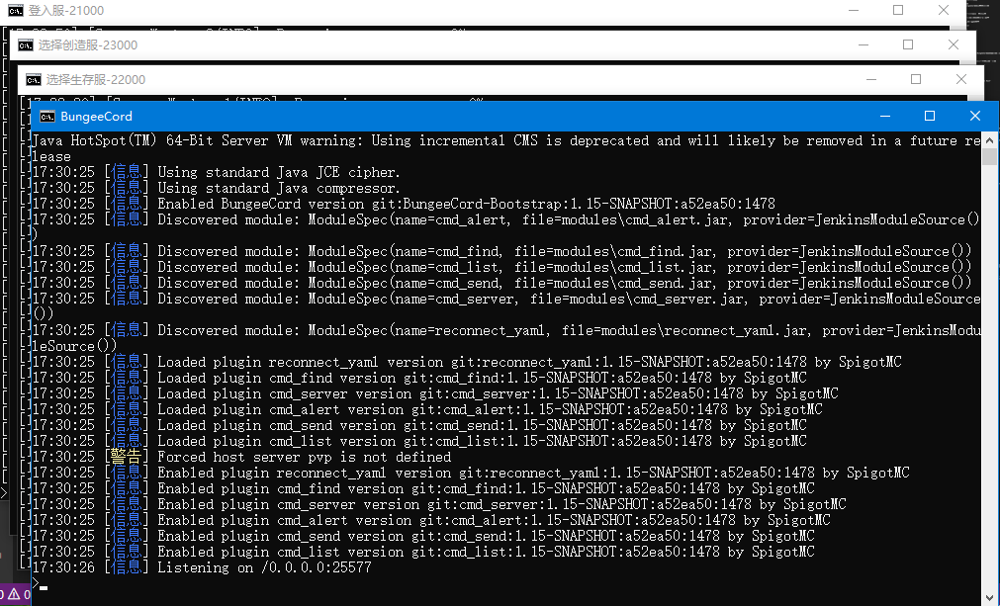

# 第七节 什么是跨服？

跨服同时也是搭建我的世界服务器中的一项复杂的一门技术，在搭建多个服务器时，要做一些研究以及了解的工作。

## 自我思考

1. 我是不是需要跨服？
2. 我的服务器是否有那么多的玩家在游玩？
3. 我的服务器是不是性能多余，核心老是满不起来？
4. 想不想把服务器做大，游戏内容多样话，同时玩家在游玩的时候体验的非常舒适？

如果是的请继续往下

## 了解
跨服大致就是“[分布式部署](https://baike.baidu.com/item/%E5%88%86%E5%B8%83%E5%BC%8F%E7%B3%BB%E7%BB%9F/4905336?fr=aladdin)“我的世界的服务端从而提高服务器硬件的利用率的一种技术手段。

也就是[代理服务器](https://baike.baidu.com/item/%E4%BB%A3%E7%90%86%E6%9C%8D%E5%8A%A1%E5%99%A8/97996?fr=aladdin)，他的作用就是代理玩家进入到服务器内部的一个个子服务端，作为内网与外网之间的桥梁。

#### 从前到后、从后到前、跨服版本数量繁多
[BungeeCord](https://www.spigotmc.org/wiki/bungeecord/)、[Velocity](https://www.velocitypowered.com/downloads)、[Lilypad](http://ci.lilypadmc.org/)、[WaterFall](https://papermc.io/downloads#Waterfall)、[HexaCord](https://yivesmirror.com/downloads/hexacord)、[Travertine](https://papermc.io/downloads#Travertine)、[Minecraft-Proxy](https://github.com/bangbang93/minecraft-proxy)

## 本次采用的是 BungeeCord

首先构思一下服务器的框架以及配置文件

## 学习 配置文件（```Config.yml```）详细介绍
```
server_connect_timeout: 5000 
#服务器无响应，多少毫秒后BungeeCord会关闭这个连接
remote_ping_cache: -1 
#远程Ping缓存
forge_support: false 
#ForgeMOD支持，如果有MOD服务器，请打开这个选项
player_limit: -1 
#玩家限制，它将限制整个服务器的玩家人数，-1为不限
permissions: 
# BungeeCord服务器权限组 也就是指令权限
  default: 
  - bungeecord.command.server 
  #服务器
  - bungeecord.command.list 
  #显示在线玩家
  admin: 
  - bungeecord.command.alert 
  #全服公告
  - bungeecord.command.end 
  #关闭BungeeCord
  - bungeecord.command.ip 
  #IP
  - bungeecord.command.reload 
  #BungeeCord重载插件权限
timeout: 30000 
#当玩家在BungeeCord中无响应多长时间，BungeeCord才会将他踢出去，
log_commands: false 
#记录命令
network_compression_threshold: 256 
#这个参数只有1.8的服务端才有，含义是网络封包压缩的阀值。
online_mode: true 
#正版验证，如果是盗版服请关闭
disabled_commands: 
#服务器禁止的指令
- disabledcommandhere
servers: 
#子服务器列表
  lobby: 
  #服务器名称
    motd: '&1Just another BungeeCord - Forced Host' 
    #服务器MOTD 支持颜色字符
    address: localhost:25565 
    #服务器的内网ip地址以及端口
    restricted: false 
listeners: 
- query_port: 25577 
#UDP查询端口
  motd: '&1Another Bungee server' 
  #客户端列表看到的服务器介绍
  tab_list: GLOBAL_PING 
  query_enabled: false 
  #是否开启UDP监听查询
  proxy_protocol: false 
  #代理协议
  forced_hosts: 
  #可以用域名绑定通过域名直接进入指定服务器
    pvp.md-5.net: pvp
  ping_passthrough: false 
  #是否穿透BungeeCord直接获取后端服务器ping信息，如motd等。
  priorities: 
  #优先服务器列表，就是登录服务器或者大厅服务器
  - lobby
  bind_local_address: true 
  #是否把BungeeCord端和你服务器通讯的IP地址设置为BungeeCord端监听的地址
  host: 0.0.0.0:25577 
  #BungeeCord的IP地址，访问它就能进入BC服务器进入其他服务器。
  max_players: 1 
  #服务器显示的最大人数 不是真实人数
  tab_size: 60 
  #按Tab键的时候，显示的玩家列表总容量。60的时候是三列，80的时候是四列
  force_default_server: false 
  #强制跳转到默认服务器
ip_forward: false 
#是否启用真实IP与UUID转发功能
remote_ping_timeout: 5000 
#远端服务器无响应，多少毫秒后BungeeCord会关闭这个连接
prevent_proxy_connections: false 
#防止远端使用代理登入
groups: 
#玩家组权限
  md_5:
  - admin
connection_throttle: 4000 
#连接间隔，当玩家退出后多就能加入
stats: b2bd44d7-c14e-4a4c-8s67-e5ecdf22d160 
#机器码，请不要修改，服务端会自己生成的
log_pings: true 
# 记录ping指
```

## BungeeCord 搭建

我们假设以三个服为准：登入服、生存服和创造服。

玩家可以通过指令、菜单和传送门到达各子服务端，同步玩家的背包以及状态、聊天以及公告。


#### 在 BungeeCord目录下 ```config.yml``` 配置 ```servers:``` ```host:```

```
host: 0.0.0.0:61390
#定义为 0.0.0.0 指接受任意地址连接
#端口需要根据服务商提供的对外开放的端口设置，独立IP则自选。
servers:
  服务器名称(可以中文最好英文):
    motd: '子端标语（可以保留不变）'
    address: 子端地址:子端端口
    restricted: false
```

如下：


```
server:
  登入服:
    motd: '&1Just another BungeeCord - Forced Host'
    address: localhost:21000
    restricted: false
  生存服:
    motd: '&1Just another BungeeCord - Forced Host'
    address: localhost:22000
    restricted: false
  创造服:
    motd: '&1Just another BungeeCord - Forced Host'
    address: localhost:23000
    restricted: false
```

#### 服务器目录框架


对应的修改每一个子服务端的server.properties

```
登入服
server-ip=127.0.0.1
server-port=21000
生存服
server-ip=127.0.0.1
server-port=22000
创造服
server-ip=127.0.0.1
server-port=23000
```
**注意：设置127.0.0.1 = localhost` 防止玩家不经过登入服务端直接访问到子服务端 务必设置到内网地址**
如果是使用 Spigot 类型的端一般目录下会有一个```spigot.yml```文件，在其中需要将 bungeecord 修改为 True 来支持跨服的协议：
```
bungeecord: false
```
如此一来，我们便成功地搭建了一个有三个子端的Bungee群组服务器。



在后期也可以安装BungeeCord安装相关的[插件](https://www.spigotmc.org/resources/categories/bungee-proxy.3/)来加强Bungee的功能。
