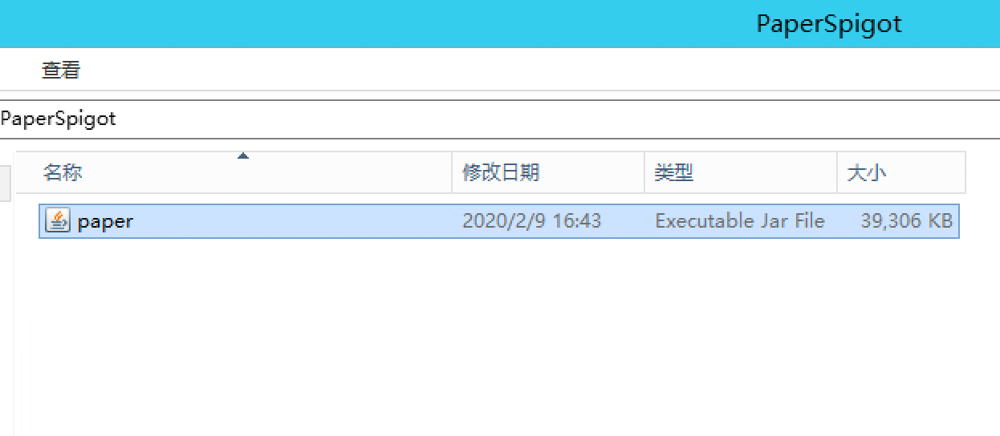
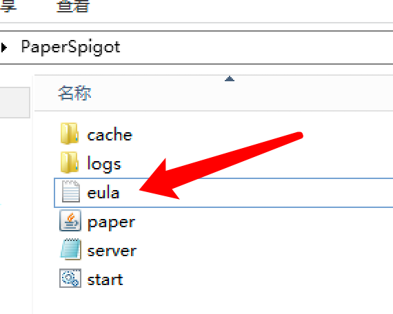
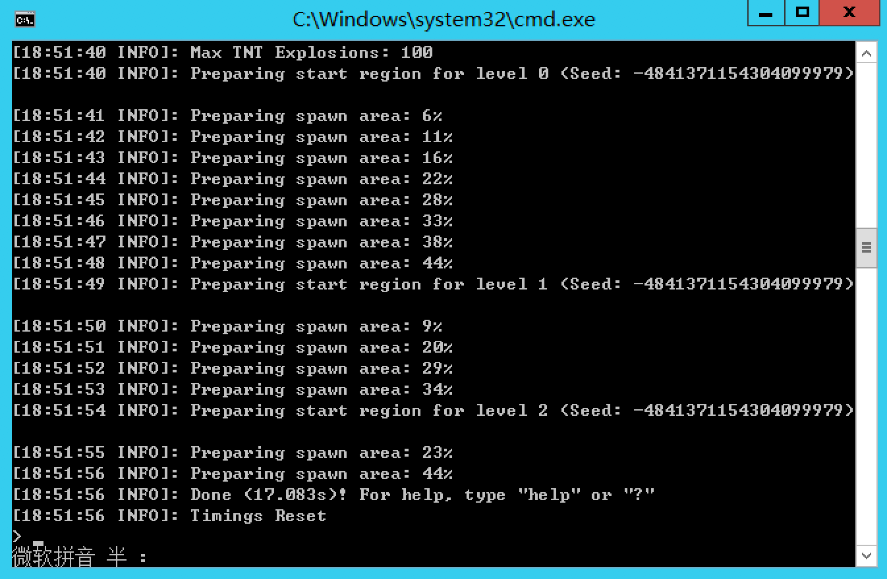
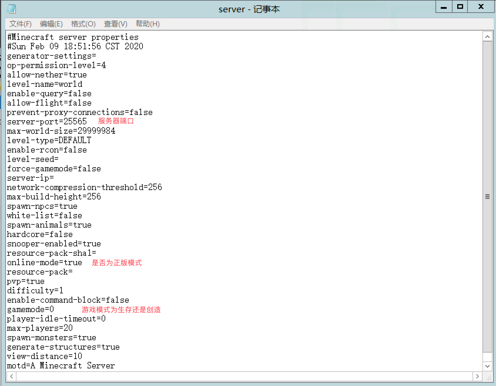
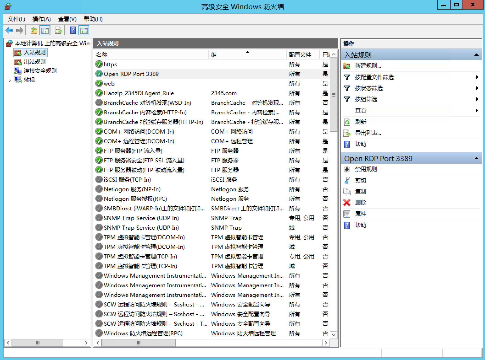
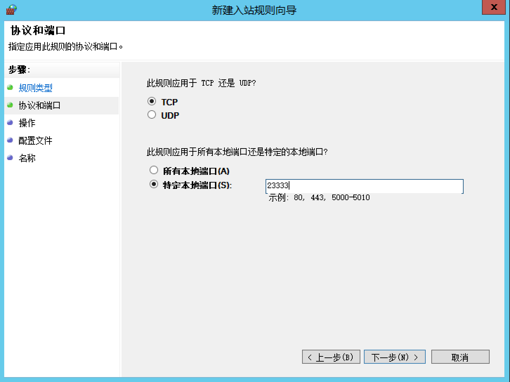
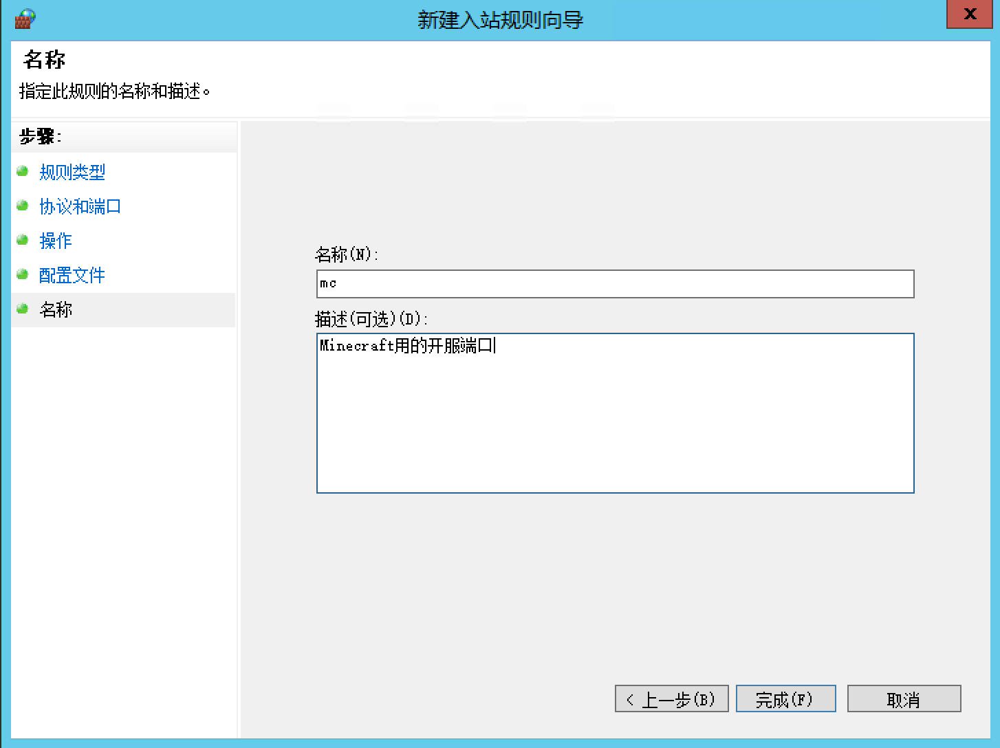

# 第一节 第一次的开服

#### 1.选择一个合适的服务端核心

目前的服务端核心大概有这样几种：

|核心名称|描述|指路|
| :------------ | :------------ | :------------ |
|官方服务端|无法添加插件，安装forge后可以添加mod|https://www.minecraft.net/|
|Bukkit/CraftBukkit|似乎是笔者印象中最为原始的插件服务端，并不支持添加MOD，但可以添加Bukkit插件|https://www.getbukkit.org/|
|Spigot|Spigot对Bukkit进行了优化，不支持添加mod，但支持添加Bukkit插件|https://hub.spigotmc.org/jenkins/job/BuildTools/|
|Paper|Paper对Spigot进行了优化，不支持添加mod，但支持添加Bukkit插件|https://papermc.io/|
|TacoSpigot|Taco同样对Spigot进行了优化，同为不能添加mod的Bukkit插件端|https://github.com/TacoSpigot/TacoSpigot|
|Glowstone|一个完全开源的服务端，支持Bukkit插件。版本为1.12.2，中文介绍 https://www.mcbbs.net/thread-926208-1-1.html |https://www.glowstone.net/|
|MCPC+/Cauldron|可以安装Mod及Bukkit插件，但性能令人捉鸡。最大支持版本1.7.10|https://sourceforge.net/projects/cauldron-unofficial/files/old_releases/version_1/|
|KCauldron|可以安装Mod及Bukkit插件，但最大支持版本仅到1.7.10|https://sourceforge.net/projects/kcauldron/|
|Thermos|KC的优化版本，最大支持版本1.7.10|https://cyberdynecc.github.io/Thermos/install|
|Uranium|KC的优化版本，最大支持版本1.7.10|https://www.uraniummc.cc/|
|Catserver|国人开发的1.12.2Mod+Bukkit插件服务端|https://www.mcbbs.net/thread-840599-1-1.html|
|Sponge|拥有自己的插件体系，在1.8及以上版本能做到Mod与Sponge插件的共同使用|https://www.spongepowered.org/|
|Vanilla|支持Sponge插件但不支持Mod的轻型核心|https://www.spongepowered.org/|

#### 2.添加启动脚本并运行

> - 这里我们选用 PaperSpigot1.12.2 进行演示。
>
> - 下载地址：https://papermc.io/
>

 首先在我们的电脑上新建一个文件夹，建议纯英文路径。
 
 将下载好的`paper.jar`扔进去。
 


 在文件夹内创建一个 start.bat，使用 记事本 或 Notepad++ 打开。
 
 输入最基本的启动脚本参数：

```bash
@ECHO OFF
java -Xmx1G -Xms1G -jar paper.jar
pause
```

保存并运行。


>
> 找到文件夹中的 eula.txt 文件，将其中的 eula=false 改为 eula=true ;
> 
> 重新启动 start.bat ;
>
 我们发现服务器现在已经可以成功启动了。
>

> 在终端窗口中输入 stop 停止运行。

 在根目录中找到`server.properties`文件。
>
 我们可以根据情况修改几个重要内容。
>

#### 3.对服务器进行一些配置
- 在高级安全 Windows 防火墙开放刚刚在`server.properties`中填写的端口（也可以选择直接关闭高级安全 Windows 防火墙，但有安全隐患，不推荐。）
> 
> 打开服务器管理器。
>

> 找到工具->高级安全 Windows 防火墙->入站规则。
>
> 新建规则，选择端口。
>
> 下一步。
>

> TCP，特定本地端口，输入你想要开放的端口。
>
> 下一步。
>
> 允许连接。
>

> 下一步怼到底。
>
至此，您应该能通过您服务器的 「IP地址:端口」 来连接您的服务器了。

> P.S. 如果您使用的一些大型企业的公有云服务商（如阿里云）要求通过服务商自己的管理系统开放端口，那么仅仅是在入站规则中添加是不够的，这时您需要了解一下您服务商的具体情况。

#### 4.一些建议

您当然可以选择通过他人整理好的整合包进行开服，但是笔者并不建议这种做法。因为自己从头到尾整合的服务端才是自己最了解的服务端，在自己整合的过程中看着自己的 `pulgins` 和 `mods` 文件夹慢慢丰富起来，配置文件中的每一条配置自己都无比熟悉，没有什么比这感觉更好了（我自己是这样想的）。

此外，大家在自己整理的服务端中更容易处理报错，也更容易优化玩家的体验，所以我建议可以享受一下制作服务端的过程，体验一下整合服务端的快乐。
