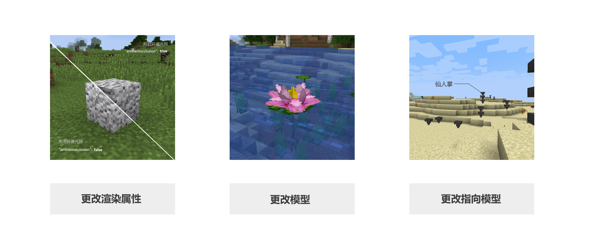
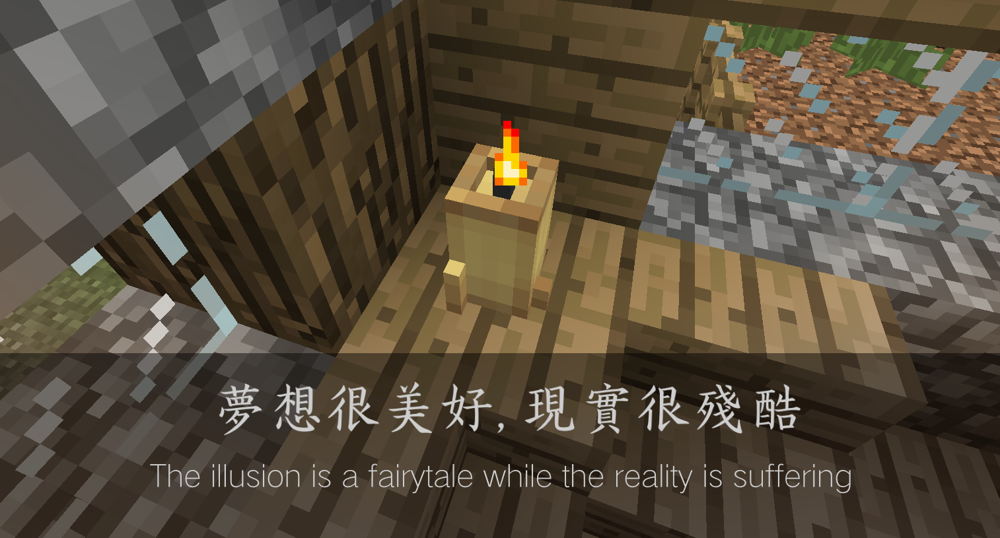
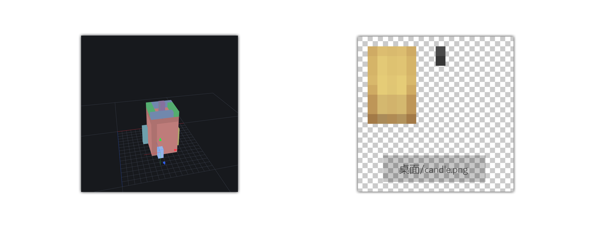
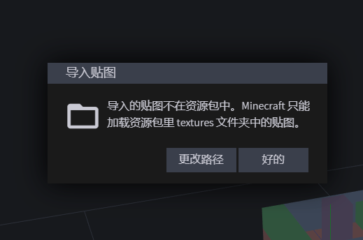
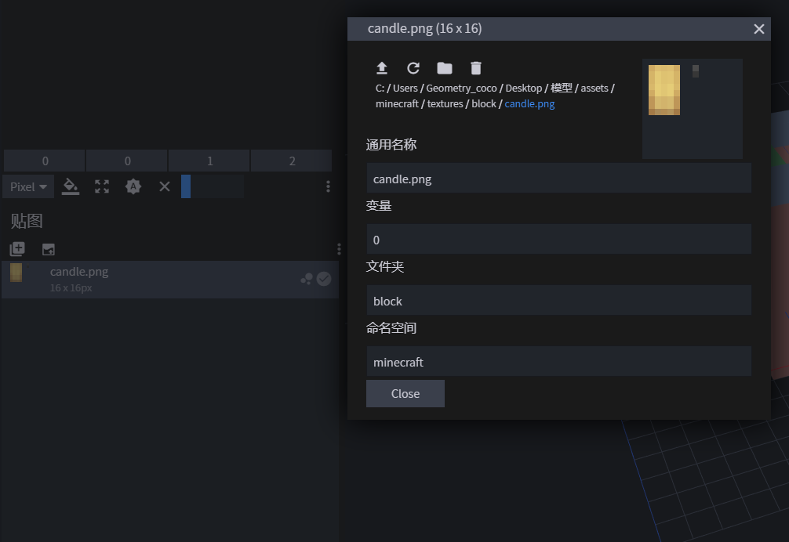
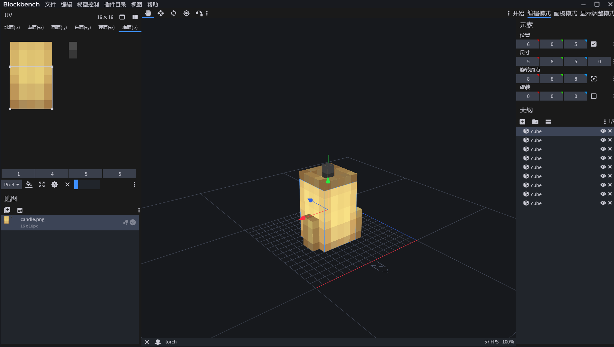
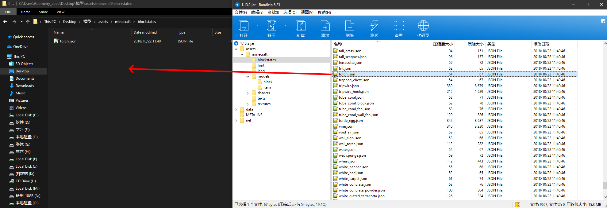
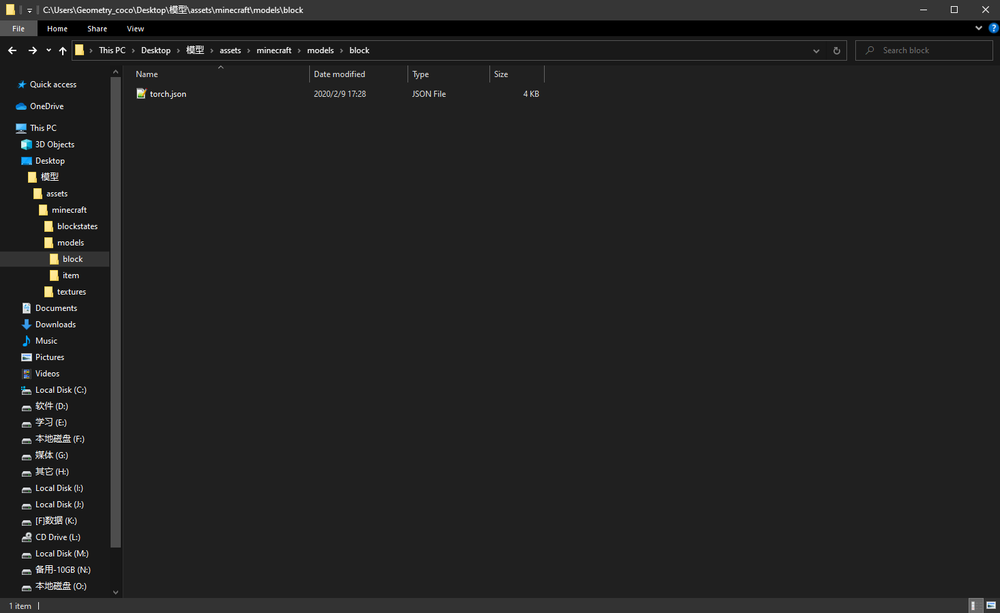
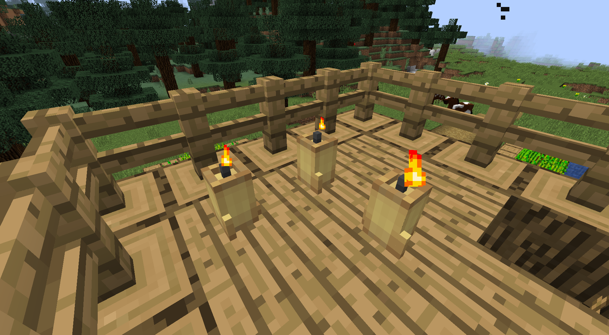

# 第三节  什么是3D建模

3D建模是MC在1.8及以后版本基本完善的一个功能, 能够让玩家任意更改游戏内方块, 物品的模型, 和更改游戏对应方块物品的指向模型, 更强大的, 还可以更改模型中某个部分的渲染属性。

对于服主来说，更改模型不仅可以显示自己服务器的逼格，体现服务器的特色，还可以实现某些特定功能，尤其是对RPG服务器的服主。制作许多诸如法杖，宝剑；亦或盘子，各种机器。增添服务器的色彩，优化玩家对服务器的第一印象。

MC目前只能修改物品和方块的模型，并不能修改实体，或穿在身上的盔甲的模型。

## 如何制作模型

制作模型的手段有很多，可以硬着头皮写 json 代码。但很显然，用软件制作会简单很多。这里推荐两个软件：Cubik Studio 和 Blockbench。前者是非常专业的制作软件，且需要购买；后者是简洁，轻量，适合新手但功能绝对够用的免费软件。Cubik Studio就像Photoshop，而Blockbench就像paint.net，制作模型就如处理图片，两者完全够用，但太多的功能可能会让人一时眼花缭乱，所以我推荐使用Blockbench。

​	推荐教程：

​			Cubik Studio：https://www.mcbbs.net/thread-687670-1-1.html

​			Blockbench：https://www.mcbbs.net/thread-833634-1-1.html

下面来详细介绍一下如何利用Blockbench制作一个模型

​	**难以理解且易错的点： 1. 如何导入贴图		2. 如何将制作的模型应用到游戏内**

软件的操作方法这里就不再赘述了，因为软件的操作并不是真正的难点。Blockbench易上手，自己摸索一下可能就懂了，实在不懂还可以看教程。

实例：制作一个蜡烛模型，替换MC原有的火把的模型

这是我想象中的样子：

现在我已经做好了模型的大致样子，和一张贴图，贴图的保存位置在桌面

下面我要导入这个贴图，那么问题来了，这个贴图是应该就放在桌面呢，还是应该移到资源包的目录 **模型资源包/assets/minecraft/textures/block** 下？注意，用Blockbench制作的模型文件是json文件，json文件并不会保存图像信息，所以贴图应该移至/textures下，最好是textures/block下。

如果导入非资源包目录下的文件，游戏在加载时会找不到这些文件，从而出现错误。对此Blockbench也有提示。

现在我们成功地导入了candle.png

通过拖动赋予材质，和右上角的调整UV，我们的模型有了颜色。

将这个模型保存为torch.json。随后，打开**游戏目录下的**.minecraft/version/对应版本/对应版本.jar。我这里用的是1.13.2版本，所以我打开的是1.13.2.jar。

在1.13.2.jar/assets/minecraft/blockstates内找到torch.json。把这个文件复制到**模型资源包/assets/minecraft/blockstates**下，也就是我们自己资源包的blockstates下。打开torch.json，我们可以看到。

> {
>     "variants": {
>         "": { "model": "block/torch" }
>     }
> }

variants可以理解为形式。我们可以看到，torch这个方块的模型（model），指向了block/torch。block/torch省略了很多东西，完整的形式是 资源包/assets/minecraft/model/**block/torch.json**。

上面说得也许太复杂了。这些代码有什么意义，这里我形象地给大家讲一下游戏程序，blockstate（方块状态），model之间的关系。

> Minecraft.exe：Blockstate，听好了，我现在要读取火把的模型，
>
> Blockstate：我找找，我这里的torch.json告诉火把的模型在models/block/torch.json
>
> Minecraft.exe：彳亍

也就是说，游戏要读取火把的模型，它会最先找blockstates里的torch.json。这是早已写在游戏程序里的，无法改变。换句话说就是，要读取火把的模型，你不能让游戏去读取blockstates里的oak_log.json（橡木原木），而是torch.json。随后，游戏会根据blockstates/torch.json写的东西，进一步去读取/models下的模型文件。比如说，我们想让仙人掌的模型变成漏斗的模型，如最上面的那张图片所示，我就会把blockstates/cactus.json里指向block/cactus的一行改成block/hopper，让游戏读取hopper.json而非cactus.json。（cactus 仙人掌、hopper 漏斗）

回过头来，再看blockstates/torch.json里的代码 `{    "variants": {  "": { "model": "block/torch" }   } }`。可见火把的模型指向的是models/block/torch.json，所以我们把做好的蜡烛模型复制到此。

我们成功了

       

