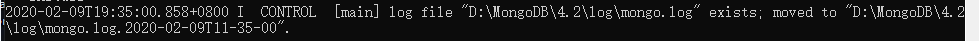

# 第四节 MongoDB 的运用
作者环境： Windows10 1809

**建议使用免安装版**

Msi安装包安装：[点我转跳](#msi安装包安装)

`mongo.config`详解：[点击跳转](#mongoconfig详解)

## 免安装版
1. 先到官网：[https://www.mongodb.com/download-center/community](https://www.mongodb.com/download-center/community "https://www.mongodb.com/download-center/community")
 
 或者可以直接点这个链接下载：[https://fastdl.mongodb.org/win32/mongodb-win32-x86_64-2012plus-4.2.3.zip](https://fastdl.mongodb.org/win32/mongodb-win32-x86_64-2012plus-4.2.3.zip "https://fastdl.mongodb.org/win32/mongodb-win32-x86_64-2012plus-4.2.3.zip")

2. 在有条件的情况下最好将MongoDB放在除系统分区外的其他分区
在这里我放在了“D:\MongoDB\4.2”


3. 创建"/data" 和 "/log" 两个文件夹（"/data"文件夹下，用于存放数据库数据；"/log"文件夹下，用于存放日志）
	1. 在data文件夹下创建"/db"空文件夹
	
	
	
	
	2. 在log文件夹下创建"mongo.log"空文件
	
	
	

`data`和`log`两个文件夹的位置可以随意，不必须放在MongoDB程序的目录下，后面将在配置文件内设置，我这里就为了方便就放在一起了

4. 配置系统环境变量path（可选）
我的电脑->属性->高级系统设置->环境变量->系统变量->选择“Path”->编辑->在后面添加MongoDB的bin目录例如“;D:\MongoDB\4.2\bin”(注意：新版本的Windows 10 不需要加;)不明白请跳过步骤4


5. 在MongoDB安装路径下创建配置文件“mongo.config”
安装路径例：D:\MongoDB\4.2


6. 为“mongo.config”添加内容
下面的`dbpath`和`logpath`请根据自己的实际情况填写
```
#数据库文件的存放位置
dbpath=D:\MongoDB\4.2\data\db
#日志文件存放的路径
logpath=D:\MongoDB\4.2\log\mongo.log
# 设置绑定ip
bind_ip = 127.0.0.1
# 设置端口
port = 27017
# 是否以安全认证方式运行，默认是不认证的非安全方式
auth = true
```
“mongo.config”详解:[点击跳转](#mongo.config详解)

7. 请以管理员身份运行cmd或者PowerShell
注意：如果跳过了步骤4，请使用cd命令转跳到MongoDB的bin目录下
（例：cd D:\MongoDB\4.2\bin 如果不在D:\磁盘符下还需输入D:转跳到D分区下）如果设置了步骤4可跳过
之后复制以下指令
```bash
mongod --config "D:\MongoDB\4.2\mongo.config" --serviceName "MongoDB" --serviceDisplayName "MongoDB" --install
```
请将`D:\MongoDB\4.2\mongo.config`换成你`mongo.config`的位置

当你看到类似下图的信息是说明MongoDB就安装成功了

到这里不要急着关cmd

8. 同样需要有管理权限的cmd
输入下面指令来运行MongoDB
```bash
net start MongoDB
```

看到“已经启动成功”就说明MongoDB已经正常启动了

如果你还不放心你可以打开浏览器输入`127.0.0.1:27017`这里的端口就是你上面设置的

看到这个页面你的MongoDB就成功运行了，可以使用客户端操作MongoDB了

------------

## Msi安装包安装

1. 与免安装版相同到官网下载安装包：[https://www.mongodb.com/download-center/community](https://www.mongodb.com/download-center/community "https://www.mongodb.com/download-center/community")

连网站都懒得打开的童鞋们呢可以直接点击链接下载：[https://fastdl.mongodb.org/win32/mongodb-win32-x86_64-2012plus-4.2.3-signed.msi](https://fastdl.mongodb.org/win32/mongodb-win32-x86_64-2012plus-4.2.3-signed.msi "https://fastdl.mongodb.org/win32/mongodb-win32-x86_64-2012plus-4.2.3-signed.msi")

下完应该是这么个图标的东西


2. 双击运行“Next”到第二个界面


如果你想自定义安装软件或者MongoDB的安装目录请选择`Custom`如果不想调直接选择`Complete`（这里我建议调整MongoDB的安装目录到"D:\MongoDB\4.2"）


3. 调整数据库数据存储位置和Log存储位置


这里我分别放在了"D:\MongoDB\4.2\data"和“D:\MongoDB\4.2\log”(强烈建议修改默认位置，这个都懒得调不建议用数据库了)

4. 这个界面会让你选择是否安装一个叫"Compass"的东西
`Compass`是4.x之后的一个新功能，就是GUI功能（可视化工具） 这里不建议勾选（没必要、加长安装时间、占空间）


5. Next之后，MongoDB就开始安装了，等待安装成功即可


------------

## mongo.config详解
```
# 数据库文件位置
dbpath=/var/lib/mongodb

#日志文件的路径
logpath=/var/log/mongodb/mongodb.log

# 是否追加方式写入日志，默认True
logappend=true

# 设置绑定ip
bind_ip = 127.0.0.1
# 设置端口
port = 27017

# 是否以守护进程方式运行，默认false
fork = true

# 启用日志文件，默认启用
journal=true

# 启用定期记录CPU利用率和 I/O 等待,默认false
#cpu = true

# 是否以安全认证方式运行，默认是不认证的非安全方式
#noauth = true
#auth = true

# 详细记录输出，默认false
#verbose = true

#用于开发驱动程序时验证客户端请求
#objcheck = true

# # 启用数据库配额管理,默认false
#quota = true

# 设置oplog日志记录等级，默认0
#   0=off (default)
#   1=W
#   2=R
#   3=both
#   7=W+some reads
#oplog = 0

# 是否打开动态调试项，默认false
#nocursors = true

# 忽略查询提示，默认false
#nohints = true

# 禁用http界面，默认为localhost：28017
#nohttpinterface = true

# 关闭服务器端脚本，这将极大的限制功能，默认false
#noscripting = true

# 关闭扫描表，任何查询将会是扫描失败
#notablescan = true

# 关闭数据文件预分配
#noprealloc = true

# 为新数据库指定.ns文件的大小，单位:MB
# nssize = <size>

# 用于Mongo监控服务器的Accout token。
#mms-token = <token>

# Mongo监控服务器的服务器名称。
#mms-name = <server-name>

# Mongo监控服务器的Ping间隔时间，即心跳
#mms-interval = <seconds>

# Replication Options

# 设置主从复制参数
#slave = true # 设置从节点
#source = master.example.com # 指定从节点的主节点
# Slave only: 指定要复制的单个数据库
#only = master.example.com
# or
#master = true # 设置主节点
#source = slave.example.com 

# 设置副本集的名字，所有的实例指定相同的名字属于一个副本集
replSet = name

#pairwith = <server:port>

# 仲裁服务器地址
#arbiter = <server:port>

# 默认为false，用于从实例设置。是否自动重新同步
#autoresync = true

# 指定的复制操作日志（OPLOG）的最大大小
#oplogSize = <MB>

# 限制复制操作的内存使用
#opIdMem = <bytes>

# 设置ssl认证
# Enable SSL on normal ports
#sslOnNormalPorts = true

# SSL Key file and password
#sslPEMKeyFile = /etc/ssl/mongodb.pem
#sslPEMKeyPassword = pass
```


