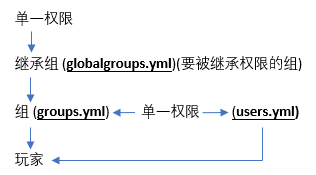

# 第三节 什么是权限？

## 权限的基本概念

在这之前我们需要了解几个概念

>权限 - 在CraftBukkit服务端中，给予用户，可使玩家获得做某一动作的允许。
>
>节点 - 权限的单元，一个节点就是一条权限，可以使用权限系统插件给予各个用户，例如`essentials.tp`就是一条权限节点。
>
>父节点 - 权限节点构成的前半部分，一般是插件名称，例如`essentials.god`权限节点的`essentials`。
>
>注册的权限/附属的命令 - 使用摘要权限(通配符`*`)时能获得的所有附属的权限。
>
>继承 - Group Manager中，继承就是子用户组可以使用从父用户组继承的各种属性。
>
>保护插件（AntiGrief） - 用于禁止爆炸，某些方块的建筑和破坏的插件，例如EssentialsProtect。
>
>映射 - 世界镜像中，一个世界使用另一个世界的配置文件，称为映射那一个世界。
>
>映射到 - 世界镜像中，一个世界映射到另一个世界表示那个世界使用这个世界的配置。
>
>父世界 - 被映射的世界。
>
>子世界 - 映射其它世界的世界。
>
>手动 - 指直接使用文本编辑软件修改配置YAML文件，而不是在游戏中或控制台使用命令。

权限就是可以让服主和管理组能有效地管理用户的权限，能够准确地控制一个玩家能干什么、不能干什么，权限的配置并不是很困难

我的世界服务器 Bukkit 系主要的权限插件有几个：

- PermissionsEX
- PowerfulPerms
- bPermissions
- GroupManagerX
- zPermissions
- LuckPerms

服务器基本的权限主要分为以下几种,并且以下的几种权限组使用了组继承，从最上方的新人(Newbie)用户组开始，一直到最下方的服主(Owner)

|组名|说明|
| :------------ | :------------ |
|Newbie(新人)|Newbie用户组包括最基础的权限节点，应该给予所有新加入玩家在注册时保证安全的权限|
|Player(玩家)|Player用户组包括了所有玩家可以使用的权限。一般包含经济、基础传送，和其他的基础指令|
|Moderator(协管员)|接下来的两个用户组可以基于你的喜好合并或更深入地分开。典型地，最低级的协管员等级拥有踢出玩家、监禁玩家的权限，高级的协管员可以获得封禁玩家IP地址、隐身、生成创造模式物品的允许。|
|Admin(管理员) / Owner(服主)|服主用户组一般允许使用所有权限/命令，且通常是唯一一个拥有控制插件、规定用户组、关闭/重启服务器命令的用户组。|

当然你也可以自定义一个例如VIP的权限组，拥有比普通用户更多的权限。

玩家的权限：

更多详细建议查阅 [Minecraft 插件百科](mineplugin.org/GroupManager)
