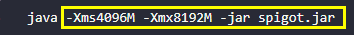
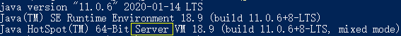

# 第一节 认识启动脚本

搭建我的世界服务器离不开Java启动脚本

**注：本文所有启动参数经`JDK-11.0.6 x64`与`JDK-1.8.0_241 x64`测试。**

------------

启动脚本主要部分就是JAVA的参数设置

在开服的过程中必须使用64位的JDK或JRE，这里建议使用`64位JDK`

如果使用32位的JAVA会受到系统的限制，最大只能设置2GB内存

## 什么是参数

在这里我直接使用一张图片来说明什么是参数



图中的黄色标注的部分就是java的参数部分

## 启动参数

```bash
@ECHO OFF
java -jar spigot-1.8.8-R0.1-SNAPSHOT-latest.jar
pause
```

这就是一段最基础的启动脚本，我们会以这个为基础进行修改与优化

启动参数主要分为3类：

> - 标准参数（-）：所有的JVM实现都必须实现这些参数的功能，而且向后兼容；
> - 非标准参数（-X）：默认jvm实现这些参数的功能，但是并不保证所有jvm实现都满足，且不保证向后兼容；
> - 非Stable参数（-XX）：此类参数各个jvm实现会有所不同，将来可能会随时取消，需要慎重使用；


下面就从最基础和的几个参数入手，了解它们的作用与使用

|参数|说明|
| :------------ | :------------ |
| -jar | 执行jar文件|
| -client | 设置jvm使用client模式，特点是启动速度比较快，但运行时性能和内存管理效率不高 |
| -server | 设置jvm使用server模式，特点是启动速度比较慢，但运行时性能和内存管理效率高，适用于生产环境。在64位的jdk环境下将默认启用该模式 |

例：上面的"-jar"就属于标准参数

众所周知，Minecraft Server的核心主要部分是一个Jar包，所以我们需要使用`-jar`来指定jar包来运行它，我们`-jar`参数应写在其他参数的后方

64位的JAVA默认都会使用Server模式启动，所以这个设置可以不用写



如果想查看其他的标准参数可以在CMD或者PowerShell中输入`java`来查看

有关详细信息, 请参阅 [http://www.oracle.com/technetwork/java/javase/documentation/index.html](http://www.oracle.com/technetwork/java/javase/documentation/index.html "http://www.oracle.com/technetwork/java/javase/documentation/index.html")

### 内存设置

|参数|说明|
| :------------ | :------------ |
| -Xmx[size] | 设置最大内存大小，默认为物理内存的1/4或者1G，需大于2M，可以指定单位k(K),m(M),g(G) 下同 |
| -Xms[size] | 设置初始化内存大小(可以理解为最小内存大小)，默认为物理内存的1/64，需大于1M |
| -Xincgc | 开启增量GC[垃圾收集(Garbage Collection)通常被称为 “GC”]；这有助于减少长时间GC时应用程序出现的停顿。但可能会降低CPU对应用的处理能力。 |

这样我们的启动参数就变成了(请根据自己的实际情况进行修改)

```bash
@ECHO OFF
java -server -Xincgc -Xmx8g -Xms4g -Xincgc -jar spigot.jar
pause
```

> `-server`可写可不写

如果开的是Mod服（Bukkit+Forge 或 Sponge）建议将`-Xms`与`-Xmx`的大小设置相同

### 内存回收配置

我们这里使用的内存回收器为`G1 (Garbage First)`，所以我们要在启动参数中加上`-XX:+UseG1GC`，这样我们就能使用该回收器了

光设置使用该回收器也不行，还要对他进行一些配置，下面就会对配置参数进行讲解，你并不需要完全了解下面参数的意义与说明，可以跟着我的推荐值进行设置

`-XX:SurvivorRatio=6`这个参数设置的是Eden区与Survivor区的大小比值，设置为8,则两个Survivor区与一个Eden区的比值为2:8,一个Survivor区占整个年轻代的1/10

##### 原文：

**Survivor Ratio Sizing**
> The `SurvivorRatio` parameter controls the size of the two survivor spaces. For example,`-XX:SurvivorRatio=6`sets the ratio between each survivor space and eden to be 1:6, each survivor space will be one eighth of the young generation. The default for Solaris is 32. If survivor spaces are too small, copying collection overflows directly into the old generation. If survivor spaces are too large, they will be empty. At each GC, the JVM determines the number of times an object can be copied before it is tenured, called the tenure threshold. This threshold is chosen to keep the survivor space half full.

> Use the option `-XX:+PrintTenuringDistribution` to show the threshold and ages of the objects in the new generation. It is useful for observing the lifetime distribution of an application.

> 引用: [https://docs.oracle.com/cd/E19159-01/819-3681/abeil/index.html](https://docs.oracle.com/cd/E19159-01/819-3681/abeil/index.html "https://docs.oracle.com/cd/E19159-01/819-3681/abeil/index.html")

`-XX:G1ReservePercent=15`G1会预留一部分内存，制造一个假天花板，防止晋升失败(to-space)的情况，默认值是10

`-XX:ParallelGCThreads=4`表示JVM在进行并行GC的时候，用于GC的线程数

`-XX:ConcGCThreads=1`与Java应用一起执行的GC线程数量。默认是Java线程的1/4。减少这个参数的数值可能会提升并行回收的效率，不过如果这个数值过低，也会导致并行回收机制耗时加长

`-XX:InitiatingHeapOccupancyPercent=40`内存占用达到整个堆百分之多少的时候触发GC

下面是G1 GC的所有的开关选项的列表

| 	选项和默认值	 | 	描述	 |
| 	:------------	 | 	:------------	 |
| 	-XX:+UseG1GC	 | 	使用G1 GC	 |
| 	-XX:MaxGCPauseMillis=n	 | 	设置一个暂停时间期望目标，这是一个软目标，JVM会近可能的保证这个目标	 |
| 	-XX:InitiatingHeapOccupancyPercent=n	 | 	内存占用达到整个堆百分之多少的时候开启一个GC周期，G1 GC会根据整个栈的占用，而不是某个代的占用情况去触发一个并发GC周期，0表示一直在GC，默认值是45	 |
| 	-XX:NewRatio=n	 | 	年轻代和老年代大小的比例，默认是2	 |
| 	-XX:SurvivorRatio=n	 | 	eden和survivor区域空间大小的比例，默认是8	 |
| 	-XX:MaxTenuringThreshold=n	 | 	晋升的阈值，默认是15（译者注：一个存活对象经历多少次GC周期之后晋升到老年代)	 |
| 	-XX:ParallelGCThreads=n	 | 	GC在并行处理阶段试验多少个线程，默认值和平台有关。（译者注：和程序一起跑的时候，使用多少个线程)	 |
| 	-XX:ConcGCThreads=n	 | 	并发收集的时候使用多少个线程，默认值和平台有关。（译者注:stop-the-world的时候，并发处理的时候使用多少个线程)	 |
| 	-XX:G1ReservePercent=n	 | 	预留多少内存，防止晋升失败的情况，默认值是10	 |
| 	-XX:G1HeapRegionSize=n	 | 	G1 GC的堆内存会分割成均匀大小的区域，这个值设置每个划分区域的大小，这个值的默认值是根据堆的大小决定的。最小值是1Mb，最大值是32Mb	 |


### 行为参数

我们这里用到的有这两个参数

|参数|说明|
| :------------ | :------------ |
|-XX:+AggressiveOpts|加快编译|
|-XX:+UseFastAccessorMethods|原始类型的快速优化|

## 配置好的启动参数

**不要忘记改最后的“核心名.jar!**
**不要忘记改最后的“核心名.jar!**
**不要忘记改最后的“核心名.jar!**

重要的事情说三遍xd


**纯净服** 推荐脚本
```bash
@ECHO OFF
java -server -Xms4g -Xmx8g -XX:+AggressiveOpts -XX:+UseFastAccessorMethods -XX:+UseG1GC -XX:SurvivorRatio=6 -XX:G1ReservePercent=15 -XX:ParallelGCThreads=4 -XX:ConcGCThreads=1 -XX:InitiatingHeapOccupancyPercent=40 -jar 核心名.jar
pause
```

**MOD服** 建议使用下面的脚本，将`-Xms`与`-Xmx`的大小设置相同
```bash
@ECHO OFF
java -server -Xms8g -Xmx8g -XX:+AggressiveOpts -XX:+UseFastAccessorMethods -XX:+UseG1GC -XX:SurvivorRatio=6 -XX:G1ReservePercent=15 -XX:ParallelGCThreads=4 -XX:ConcGCThreads=1 -XX:InitiatingHeapOccupancyPercent=40 -jar 核心名.jar
pause
```

#### 如何让你的服务器在stop之后自动开服呢？

1. 只需要在脚本中在 `java -server ……` 的上一行加一个 `:开头的标签 `例如`:start`

2. 在java后加`cls`清屏（可加可不加） 

3. 最后`goto 刚才设置的标签`例如

最后脚本如下：

```bash
@ECHO OFF
:start
java -server -Xms4g -Xmx8g -XX:+AggressiveOpts -XX:+UseFastAccessorMethods -XX:+UseG1GC -XX:SurvivorRatio=6 -XX:G1ReservePercent=15 -XX:ParallelGCThreads=4 -XX:ConcGCThreads=1 -XX:InitiatingHeapOccupancyPercent=40 -jar 核心名.jar
cls
goto start
```
