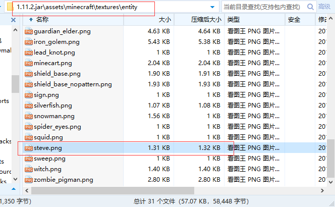
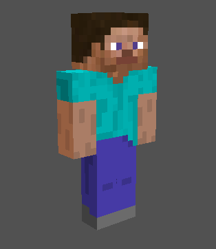
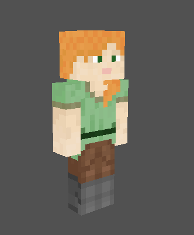
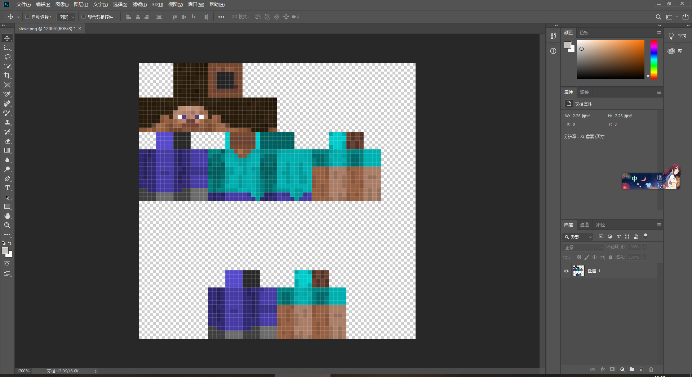
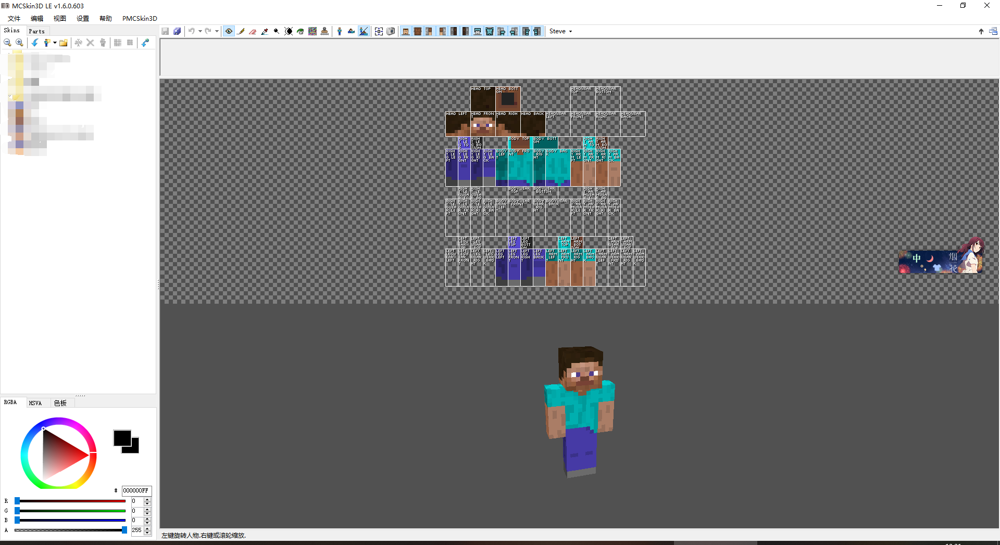

# 第四节 什么是皮肤？

皮肤，具体指的是游戏中玩家或生物所显示的材质。

既然皮肤是一种材质，则需要在材质文件中加载

我们在[认识资源包](https://github.com/Mhy278/MinecraftServerHostGuide/blob/master/Texture.md)已经学习过，皮肤文件的大致位置为`\.minecraft\versions\相应版本名称\assets\minecraft\textures\entity`, 在该目录下我们找到一个`steve.png`文件：

同理我们可以获得一个`alex.png`皮肤文件（1.8以后版本）, 两者都是 Minecraft 游戏中的默认玩家皮肤。

## 一.皮肤格式

皮肤文件均为`.png`格式。仔细观察两个皮肤，从直观上看两者有较为明显的大小区别

简单来说就是男性皮肤和女性皮肤的区别，可以看到相比男性皮肤，女性皮肤的手臂大小为3x4x8，同时手臂偏下。

由于1.8版本皮肤和之前版本有差异，并且还多了一个女性皮肤，所以在替换的时候要格外注意，否则进入游戏后皮肤会出错。

1.8版本以后的皮肤为64x64大小（即双层皮肤）
1.8版本之前的皮肤为64x32大小（即单层皮肤）
可以右键皮肤文件-属性-详细信息 查看

## 二.如何修改皮肤

### 1.单人世界

如果你只是玩单机游戏，用你所要使用的皮肤文件把`\.minecraft\versions\相应版本名称\assets\minecraft\textures\entity`中的`steve.png`替换即可
（如果默认皮肤是 Alex，相应替换即可）

原理就是单机游戏中只会加载一个玩家实体的材质，如果你在多人游戏中使用，则所有为默认皮肤的实体玩家都会加载为你的皮肤（仅你自己可见）

### 2.多人游戏

服务器可以借助一些插件或者皮肤站实现替换皮肤功能，插件和网站很多，这里就不一一举例了。

### 3.正版用户

进入官网 -> 选择 Profile-select a file 选择一个皮肤 -> upload 即可

## 三.如何绘制皮肤

打开皮肤文件，发现这是皮肤每个部分的展开图。由此我们就可以修改每个像素来绘制一个全新的皮肤

### 1.使用Photoshop

如图，用软件打开皮肤文件，就可以绘制皮肤了

### 2.MCSkin3D

推荐使用这款软件，相对ps来说更加方便

还有其他的软件和方法，在这里就不一一举例了

画皮肤也绝非是一件简单事，工作量可能比一个材质包小，但是难度却不亚于画材质包。比如色彩，阴影，各部分的衔接等都是非常重要的

推荐教程：https://www.mcbbs.net/thread-538676-1-1.html
