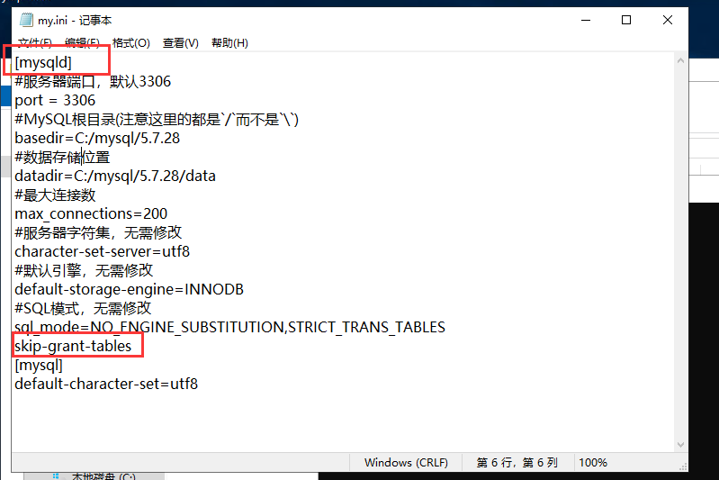

# 第三节 数据库的使用
作者环境：
 
AuthMe配置MySQL
> Windows10 1809 64-bit
> 
> Minecraft服务器核心：spigot-1.8.8-R0.1-SNAPSHOT-latest
> 
> 服务器插件：AuthMe-5.4.0

MySQL安装
> Windows Server 2019 数据中心版 64位简体中文

## 目录
本节主要分为三部分：
1. [数据库的基本介绍](#数据库的基本介绍)
2. [AuthMe配置MySQL](#authme配置mysql)
3. [MySQL的安装](#mysql的安装)
    1. [MySQL5.7免安装版本的安装](#mysql57的安装与配置)
       1. [MySQL5.7的安装](#mysql57的安装)
       2. [MySQL5.7的卸载](#mysql57的卸载)
       3. [MySQL5.7安装时常见错误总结及解决方法](#mysql57安装时常见错误总结及解决方法) 
    2. [MySQL8.0免安装版本的安装](#mysql80的安装与配置)
       1. [MySQL8.0的安装](#mysql80的安装)
       2. [MySQL8.0修改密码](#mysql80修改密码)
       3. [MySQL8.0修改root用户远程访问权限](#mysql80修改root用户远程访问权限)
       4. [MySQL8.0连接访问问题](#mysql80连接访问问题)
## 数据库的基本介绍
### 什么是数据库
> 数据库是“按照数据结构来组织、存储和管理数据的仓库”。是一个长期存储在计算机内的、有组织 的、有共享的、统一管理的数据集合。
> 
> 数据库是以一定方式储存在一起、能与多个用户共享、具有尽可能小的冗余度、与应用程序彼此独立的数据集合，可视为电子化的文件柜——存储电子文件的处所，用户可以对文件中的数据进行新增、查询、更新、删除等操作。

用字面意思解释就是存放数据的

### 数据库的两种分类
早期比较流行的数据库模型有三种，分别为层次式数据库、网络式数据库和关系型数据库。而在当今的互联网中，最常用的数据库模型主要是两种，即关系型数据库和非关系型数据库。

#### 关系型数据库

关系型数据库最典型的数据结构是表，由二维表及其之间的联系所组成的一个数据组织

##### 优点：
dd
1. 易于维护：都是使用表结构，格式一致；
2. 使用方便：SQL语言通用，可用于复杂查询；
3. 复杂操作：支持SQL，可用于一个表以及多个表之间非常复杂的查询。

##### 缺点：

1. 固定的表结构，灵活度稍欠
2. 高并发读写需求，传统关系型数据库来说，硬盘I/O是一个很大的瓶颈

#### 非关系型数据库

非关系型数据库严格上不是一种数据库，应该是一种数据结构化存储方法的集合，可以是文档或者键值对等。

##### 优点：

1. 格式灵活：存储数据的格式可以是key,value形式、文档形式、图片形式等等，文档形式、图片形式等等，使用灵活，应用场景广泛，而关系型数据库则只支持基础类型
2. 速度快：nosql可以使用硬盘或内存作为载体，而关系型数据库只能使用硬盘
3. 高扩展性

##### 缺点：

1. 不提供sql支持，学习和使用成本较高；
2. 无事务处理；
3. 数据结构相对复杂，复杂查询方面稍欠。

##### 非关系型数据库的分类和比较：

1. 文档型
2. key-value型
3. 列式数据库
4. 图形数据库

这里我做了一张数据库分类的图


## AuthMe配置MySQL

需要先运行一次服务器让AuthMe生成默认的配置文件，如果出现下面这样的字样说明AuthMe成功的加载了


在这之前请确认您的MySQL服务器是否开启，使用MySQL工具能否访问

1. 使用MySQL客户端工具，或者直接使用MySQL控制台新建一个数据库(由于Minecraft的MySQL数据库基本是本地使用，所以无需建多个MySQL用户，这里我直接使用root用户来建库)
   
2. 选择一款MySQL客户端工具，这里推荐两款PhpMyAdmin(需要有web环境)、Navicat Premium(Mysql) 

因为看本教程的大部分都是萌新，所以我这里使用最简单的`Navicat Premium(Mysql)`

官方下载地址:
> https://www.navicat.com.cn/download/navicat-premium

3. 打开`Navicat Premium(Mysql)`点击连接-MySQL，填入自己的服务器信息

    

连接名自己可以随便填写，如果是使用其他服务器上的MySQL需要使你现在客户端IP拥有你数据库用户的访问权限，如果不会请看下面安装过程。如果是本地的MySQL服务器可以直接使用localhost或者127.0.0.1，默认端口3306


4. 当你添加完连接后，双击左侧你的连接名就会连接你的MySQL数据库，就会列出现在连接的用户中拥有的数据库（我这里之前建过一些数据库）

    

5. 右键你的连接名 - 新建数据库 - 随便输入一个数据库名

    

    在这里字符集推荐使用`utf8mb4`,排列顺序使用`utf8mb4_unicode_ci`

    

    点击确定之后我们就能在左侧看到我们新建立的数据库了

    

6. 修改Minecraft服务器AuthMe插件配置文件“plugins/AuthMe/config.yml”文件

    我们只用得到配置文件的前21行

```yaml
DataSource:
    # 你想使用哪种数据库来储存
    # 数据库类型: SQLITE MYSQL
    backend: 'SQLITE'
    # 是否启用数据库缓存系统，在BungeeCord群服中或者使用网站集成时应禁用。
    caching: true
    # 数据库地址
    mySQLHost: '127.0.0.1'
    # 数据库端口
    mySQLPort: '3306'
    # 是否使用SSL连接数据库
    mySQLUseSSL: true
    # 数据库用户名
    mySQLUsername: 'authme'
    # 数据库密码
    mySQLPassword: '12345'
    # 数据库名
    mySQLDatabase: 'authme'
    # 数据表名
    mySQLTablename: 'authme'
```

   1. 首先我们需要把`backend`的值改为`MYSQL`使用MySQL作为存储数据库
   2. 如果你想开一个群服或者和你的网站或者论坛对接数据请将`caching`改为false，如果没有以上两种需求可以不做调整
   3. 将`mySQLHost`修改为你MySQL数据库的地址，如果在本地搭建的不需要做调整
   4. 将`mySQLPort`设置为你MySQL的数据库端口，MySQL默认端口3306
   5. `mySQLUseSSL`建议使用true值，不做调整
   6. `mySQLUsername`修改为你刚才创建数据库的那个用户名，我这里是"root"
   7. `mySQLPassword`数据库密码，不做解释
   8. `mySQLDatabase`修改为刚才你创建的数据库名，根据我上面图片的设置，这里我应该设置成"minecraft_server_1"，这里仅做为示例，请各位根据实际情况自行修改
   9. `mySQLTablename`存放数据的表名，可自定义修改，也可不做修改

示例：
```yaml
    # 你想使用哪种数据库来储存
    # 数据库类型: SQLITE MYSQL
    backend: 'MYSQL'
    # 是否启用数据库缓存系统，在BungeeCord群服中或者使用网站集成时应禁用。
    caching: true
    # 数据库地址
    mySQLHost: '127.0.0.1'
    # 数据库端口
    mySQLPort: '3306'
    # 是否使用SSL连接数据库
    mySQLUseSSL: true
    # 数据库用户名
    mySQLUsername: 'root'
    # 数据库密码
    mySQLPassword: '123456'
    # 数据库名
    mySQLDatabase: 'minecraft_server_1'
    # 数据表名
    mySQLTablename: 'authme'
```

7. 启动Minecraft服务器，AuthMe将自动根据设置自动创建数据表

    出现以下字样就说明AuthMe成功使用MySQL作为数据库了

    

    这时使用客户端工具就能看到AuthMe创建的数据表了

    

至此，AuthMe使用MySQL作为数据库的配置就到此结束了

## MySQL的安装

### 写在前面

安装版可以直接无脑Next，这里就不讲了，下面是讲解免安装版的安装方法

免安装版第一次配置好，一个文件夹放到哪个服务器或者电脑上都能直接用

当你成功配置一次免安装版后会发现免安装版配置如此简单

后面的MongoDB的安装也是重点讲解免安装版的使用

### MySQL5.7的安装

#### 下载

MySQL5.7官方下载地址：
> https://downloads.mysql.com/archives/community/

1. `Product Version`    选择`5.7.28`
2. `Operating System`   选择`Microsoft Windows`
3. `OS Version`         选择`Windows (x86, 64-bit)`
4. 点击`ZIP Archive`后的Download进行下载

    温馨提示：如果使用浏览器下载可以使用IDM等下载工具，如果速度还是非常慢请使用VPN

    

#### MySQL5.7安装
1. 将下载好的`mysql-5.7.28-winx64.zip`解压放在合适的位置（我这里放在了"C:\mysql\5.7.28\"）
   
    

2. 配置环境变量
   
   1. "此电脑"右键 - "属性" - "高级系统设置" - "环境变量"
   
        

   2. 在下部的"系统变量"中找到`Path`选中，点击编辑
   
        点击新增将MySQL根目录下的bin目录的位置复制进去（我这里是"C:\mysql\5.7.28\bin"）

        

        如果点击编辑后是下图这种窗口，请添加`;bin目录`(需要在前面加一个";"，例：`;C:\mysql\5.7.28\bin`)

        

3. 在MySQL根目录新建`my.ini`文件，内容如下，注意要修改自己的文件地址
    ```
    [mysqld]
    # 服务器端口，默认3306
    port = 3306
    # MySQL根目录(注意这里的都是`/`而不是`\`或者使用`\\`如果填错会刷错误)
    basedir=C:/mysql/5.7.28
    # 数据存储位置
    datadir=C:/mysql/5.7.28/data 
    # 最大连接数
    max_connections=200
    # 服务器默认字符集，无需修改
    character-set-server=utf8
    # 创建新表时将使用的默认存储引擎
    default-storage-engine=INNODB
    # SQL模式，无需修改
    sql_mode=NO_ENGINE_SUBSTITUTION,STRICT_TRANS_TABLES
    [mysql]
    default-character-set=utf8
    ```

4. 使用管理员权限打开DOS窗口(cmd)，也可以使用Powershell，但都需要以管理员权限运行
    1. 输入`mysqld --initialize-insecure`，会自动生成一个无密码的root用户（可能有人要问了，为什么没密码，不要慌，下面会设置）MySQL会自动在你设置的数据库存储位置生成文件夹及数据

        如果出现下面这种错误不要慌

        
            
        下载并安装`Visual C ++ Redistributable Package 2013`,官方下载地址： [https://www.microsoft.com/zh-CN/download/details.aspx?id=40784](https://www.microsoft.com/zh-CN/download/details.aspx?id=40784)
        根据自己的系统版本下载对应版本的软件

    2. 再输入`mysqld --install`
    3. 然后再输入`net start mysql`,启动mysql服务；对应的关闭命令为`net stop mysql`
         
        出现启动成功的字样就说明已经安装成功了，也意味着你马上就要成功了！

        

5. 启动成功后输入 `mysqladmin -u root password 新密码` 来修改密码

    我这里使用了"123456"的弱密码，请各位不要效仿

    

6. 输入`mysql -uroot -p`登录root用户，测试你是否成功修改密码，执行该命令后会提示你`Enter password`输入密码，就可以输入你的新密码登录MySQL了

    出现下面字符就说明登录成功了

    

#### MySQL5.7的卸载

1. 使用管理员权限打开DOS窗口(cmd)，也可以使用Powershell
2. 输入`net stop mysql`停止MySQL的运行
3. 输入`mysqld -remove`或者`sc delete mysql`删除MySQL的服务器


如果卸载后你又想安装上怎么办

1. 使用管理员权限打开DOS窗口(cmd)，也可以使用Powershell
2. 再输入`mysqld --install`安装成功即可
3. `net start mysql`启动服务

所以开头我说免安装版以后会非常的方便，只需带着你以前的MySQL文件夹，转到目录中的bin文件夹下执行`mysqld --install`就能使用，但是前提需要此电脑上已安装`Visual C ++ Redistributable Package 2013`


#### MySQL5.7安装时常见错误总结及解决方法

##### 问题一 ：由于找不到MSVCR120.dll,无法继续执行代码.重新安装程序可能会解决此问题。


原因：缺少运行库

解决方法：上文已经写出了解决此问题的方法，下载并安装`Visual C ++ Redistributable Package 2013`,官方下载地址： [https://www.microsoft.com/zh-CN/download/details.aspx?id=40784](https://www.microsoft.com/zh-CN/download/details.aspx?id=40784)根据自己的系统版本下载对应版本的软件

##### 问题二：mysqld: Can't create directory 'D:\mysql\5.7.28\bin\data\' (Errcode: 2 - No such file or directory)

原因：my.ini文件中的basedir（设置mysql的安装目录）、datadir（设置mysql数据库的数据的存放目录）与MySQL解压后的路径不一致  

解决方法：调整basedir为MySQL的根目录，设置有效的datadir位置

##### 问题三：设置密码时可能出现错误：ERROR 1045 (28000): Access denied for user 'root'@'localhost' (using password: NO)

解决方法：
1. 打开`my.ini`，在`[mysqld]`下添加一行`skip-grant-tables`来跳过密码验证

    注意添加位置

    

2. 重启MySQL
   1. 以管理员身份打开DOS窗口(cmd)或者PowerShell
   2. 输入依次输入`net stop mysql`和`net start mysql`
    
    

3. 输入`mysql -uroot -p`按回车，如果提示输入密码，直接回车即可

    
4. 输入`use mysql;`切换到名为mysql的数据库下,注意进入MySQL后每个命令后面要加上分号";"
5. 输入`update mysql.user set authentication_string=password('新密码') where user='root';`修改密码，请自行将`新密码`替换为您想设置的root用户密码
6. 输入 `flush privileges;`刷新保存
7. `exit;`或`quit;`退出mysql
 


8. 删除`my.ini`中刚刚添加的`skip-grant-tables`并保存
9.  重复步骤2，重启mysql
10.  之后就可以使用新密码登录root用户了

##### 问题四：我服务器上MySQL已经成功安装并运行了，我在自己电脑上为什么连接不了MySQL数据库

当然我这里不建议外网可以访问root用户

原因1：首先你的服务器需要开放你设置的MySQL数据库端口

原因2：root用户未开放远程访问权限

解决方法：
1. 打开DOS窗口(cmd)或者PowerShell
2. 输入`mysql -uroot -p`按回车，输入密码，回车
3. 输入`use mysql;`切换到名为mysql的数据库下
4. 输入`grant all privileges on *.* to 'root'@'%' identified by 'root用户的密码' with grant option;` 注意替换命令中的`root用户的密码`为你真实的root密码
5. 输入 `flush privileges;`刷新保存
6. `exit;`或`quit;`退出mysql

注意红圈地方是root用户的密码，请根据自身实际情况修改


之后你就有权限访问你服务器里的数据库了

### MySQL8.0的安装与配置

<span id="download8" />

#### 下载

MySQL8.0官方下载地址：
> https://dev.mysql.com/downloads/mysql/

1. `Select Operating System`   选择`Microsoft Windows`
2. 点击`Windows (x86, 64-bit), ZIP Archive`后的`Download`

温馨提示：如果使用浏览器下载可以使用IDM等下载工具，如果速度还是非常慢请使用VPN


#### MySQL8.0的安装

Mysql8.0的免安装版的配置前2步与5.7的配置方法相同所以在这里就不详细写了，直接从创建`my.ini`配置文件开始

如果需要看前两步请[点我转跳](#mysql57%e7%9a%84%e5%ae%89%e8%a3%85)

3. 在MySQL根目录新建`my.ini`文件，内容如下，注意要修改自己的文件地址
   
    **注意：**在MySQL 8.0中，默认的身份验证插件已从`mysql_native_password`更改为 `caching_sha2_password`，并且`'root'@'localhost'`默认使用`caching_sha2_password`。

   ```
   [mysqld]
        # 服务器端口，默认3306
        port=3306
        # MySQL根目录(注意这里的都是`/`而不是`\`或者使用`\\`如果填错会刷错误)
        basedir=C:/mysql/5.7.28
        # 数据存储位置
        datadir=E:\\software\\mysql\\mysql-8.0.11-winx64\\Data
        # 允许最大连接数
        max_connections=200
        # 允许连接失败的次数
        max_connect_errors=10
        # 服务器默认字符集，无需修改
        character-set-server=utf8
        # 创建新表时将使用的默认存储引擎
        default-storage-engine=INNODB
        # 默认使用“mysql_native_password”插件认证
        default_authentication_plugin=mysql_native_password
    [mysql]
        # 设置mysql客户端默认字符集
        default-character-set=utf8
    [client]
        # 设置mysql客户端连接服务端时默认使用的端口
        port=3306
        default-character-set=utf8
   ```

4. 使用管理员权限打开DOS窗口(cmd)，也可以使用Powershell，但都需要以管理员权限运行
   1. 输入`mysqld --initialize --console`初始化数据库，执行完后MySQL会生成一个随机的初始root密码

    类似这样的一个信息（图中红圈圈的就是初始的随机密码）：`qGdy+.pl<7uj`这个是我的随机密码，每个人的初始密码都不同（不含首位空格）在没有更改密码前，需要记住这个密码，后续登录需要用到。

    

    如果你忘记了初始密码或者手贱直接关掉了，请删掉你在`my.ini`中`datadir`（数据存储位置）选项的目录重头进行步骤4！

    参考：[https://dev.mysql.com/doc/refman/8.0/zh-CN/data-directory-initialization.html](https://dev.mysql.com/doc/refman/8.0/zh-CN/data-directory-initialization.html)

    如果出现类似下面这些错误不要慌

    

    
            
    下载并安装`Visual C ++ Redistributable Package 2015`,官方下载地址： [https://www.microsoft.com/zh-CN/download/details.aspx?id=48145](https://www.microsoft.com/zh-CN/download/details.aspx?id=48145)
    
    根据自己的系统版本下载对应版本的软件并安装即可

    1. 再输入`mysqld --install`安装MySQL服务
    2. 然后再输入`net start mysql`,启动mysql服务；对应的关闭命令为`net stop mysql`

    

<span id="password8" />

#### MySQL8.0修改密码

1. 打开一个DOS窗口(cmd)或者PowerShell
2. 输入`mysql -u root -p`，回车后会提示你输入密码，密码就是上面初始化生成的，如果你忘记了初始密码或者手贱直接关掉了，请删掉你在`my.ini`中`datadir`（数据存储位置）选项的目录重头进行步骤4！
   
    

3. 之后输入`ALTER USER 'root'@'localhost' IDENTIFIED WITH mysql_native_password BY '新密码';`注意修改你的新密码要用单引号括起来
   
4. 输入 `flush privileges;`刷新保存
   
5. `exit;`或`quit;`退出mysql

注意图中红圈地方为新密码，请自行修改


至此密码就修改完成了

<span id="host8" />

#### MySQL8.0修改root用户远程访问权限

注意8.0的开放方式与5.7的命令不同

如果你想在你自己电脑上连接你服务器上的MySQL数据库可能会无法连接

当然我这里不建议外网可以访问root用户

原因1：首先你的服务器需要开放你设置的MySQL数据库端口

原因2：root用户未开放远程访问权限

解决方法：
1. 打开DOS窗口(cmd)或者PowerShell
2. 输入`mysql -uroot -p`按回车，输入密码，回车
3. 输入`use mysql;`切换到名为mysql的数据库下
4. 输入`update user set host = "%" where user = "root";`
5. 输入 `flush privileges;`刷新权限
6. `exit;`或`quit;`退出mysql


之后你就有权限访问你服务器里的数据库了

<span id="error8" />

#### MySQL8.0连接访问问题

远程访问数据库的可视化工具比较多如：Navicat、SQLyog、MySQL workbench 等，我这里使用 Navicat

输入MySQL服务器地址、用户名和密码，报`2059`错误，这是因为 MySql8.0 版本 和 5.x 的加密规则不一样，而现在仍有少部分可视化工具仍然只支持旧的加密方式，可能**有插件连接时也会报`2059`的错误**

我们在安装的时候，如果你使用了我上方贴出的`my.ini`作为模板修改就应该不会出现此问题，但也不排除仍有极少部分用户仍然无法连接，所以我们下方给出解决方法

这里我们可以直接修改加密规则

1. 打开DOS窗口(cmd)或者PowerShell
2. 输入`mysql -uroot -p`按回车，输入密码，回车
3. 输入`use mysql;`切换到名为mysql的数据库下
4. 输入`ALTER USER 'root'@'localhost' IDENTIFIED BY '你当前的root用户密码' PASSWORD EXPIRE NEVER;`
5. 输入`ALTER USER 'root'@'%' IDENTIFIED WITH mysql_native_password BY '输入新的root用户密码';`当然也可以选择直接输入你原来的密码
6. 输入 `flush privileges;`刷新权限
7. `exit;`或`quit;`退出mysql
