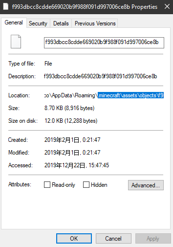
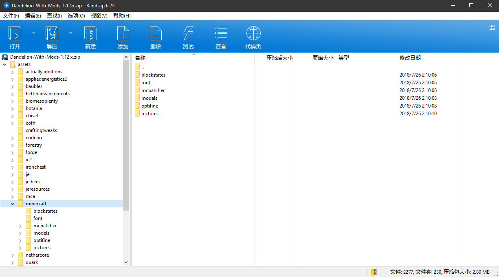
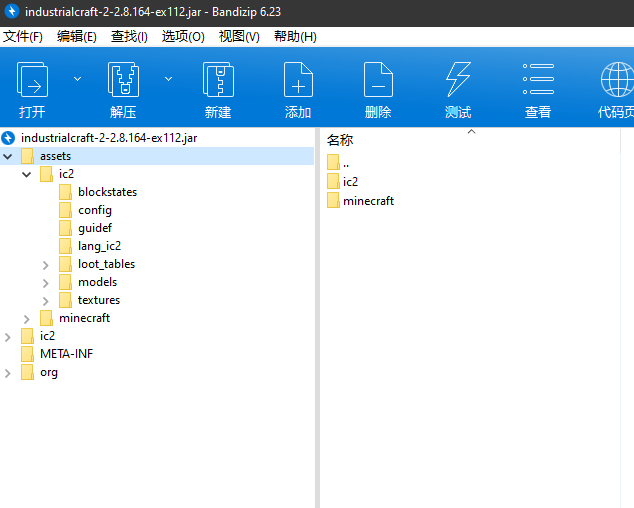

# 第二节  认识资源包


## 资源包结构

以 1.11.2 版本为例。首先创建一个文件夹。打开 `1.11.2.jar` 核心文件，我们可以看到名为 `assets` 的文件夹。把 `assets` 复制到我们新建的文件夹里，`assets` 内包含了大部分可修改的游戏贴图，但并不完全。下面来介绍一下材质包的文件目录。

```
\材质包
	pack.png
	\assets
		\minecraft
			\blockstates
			\models
			\textures
				\blocks			方块材质	
				\entity			实体材质
				\environment	        日月、雨雪材质
				\gui			用户界面材质
				\items			物品材质
				\map			地图界面材质
				\models			盔甲材质
				\painting		画材质
				\particle		粒子材质
				\......
			\......
	pack.mcmeta
```

`assets/minecraft` 目录下的文件都包含了原版游戏的大部分内容，例如 `blockstates `和 `models` 和模型有关，text 和游戏的文本有关。而游戏的贴图文件都存在 `textures` 文件夹中。

但同时我们发现，材质包目录下除了 `assets` 文 件夹，还有 `pack.png` 和 `pack.mcmeta`。`pack.png` 是材质包的图标。重点是 `pack.mcmeta` ，这个文件在游戏 jar 文件内找不到，你可以新建一个 txt 文档，将 `新建文本文档.txt` 改成 `pack.mcmeta`，再用可以处理文本文件的应用打开。这个文件内的基本内容是这样的。

> {
>   "pack": {
>     "pack_format": 4,
>     "description": "123456ABC"
>   }
> }

`pack_format` 后的数值代表这个资源包适用的版本。1.8.9及以前版本填1，1.9至1.10.2填2，1.11至1.12.2填3，1.13至1.14.4填4，1.15及以后填5。

`description` 后的引号内是资源包的介绍，介绍会在选择资源包时出现在资源包名称的下方。


## 如何修改原版音效

难点：1. 找到原版的音频文件	2. 根据 `indexes` 下各版本的 json 文件所写的内容修改资源包的音频文件

游戏能读取 `.ogg` 格式的音频，如果你做好了一个音效，但它是 mp3 或其它格式，你可以用格式工厂转码。

我们打开某个版本的jar文件，我们并不能找到任何音频文件。音频文件储存在游戏根目录 `.minecraft\assets\object\ `下的各个文件夹里，但是 `object` 下的文件夹没有按一定的规律命名，且这里面保存的不仅仅有音频文件，许多游戏项目文件也包含其中。以1.12版本为例，我们想要找到打开箱子音效的音频文件，我们应该在游戏根目录 `.minecraft\assets\indexes` 下找到对应的版本的 json。打开`1.12.json`，利用查找箱子的英文名 chest 或者其它方法，我们可以查找到以下部分

```
"minecraft/sounds/block/chest/close.ogg": {"hash": "a7d0d6f761c9a647cc0273bc016f2772b85f6d88", "size": 7590}, 
"minecraft/sounds/block/chest/close2.ogg": {"hash": "eaa2cfc2ca71f219930cc496d5316853364d3623", "size": 7896},
"minecraft/sounds/block/chest/close3.ogg": {"hash": "fda6f8d1f1daabad0fd78903cd3c4b366f77a8e5", "size": 7116}, 
"minecraft/sounds/block/chest/open.ogg": {"hash": "f993dbcc8cdde669020b9f988f091d997006ce8b", "size": 8916},
```

最下面，我们可以看到 `chest/open.ogg` 字样。这时我们复制hash后面引号内的内容，也就是f99....8b，再进入到 `assets/object` 里查找，我们就可以找到这样的文件



这个文件没有后缀名。当我们加上 `.ogg` 后缀名后播放，我们就可以听到箱子打开的音效。

------

下面是一个利用资源包修改原版音效的实例。以1.12版本为例，我们现在已经有一个名为 `1.ogg` 的音频文件，打开后可以听到“叮咚”的声音，我们想用这个替换原版拾取经验球的声音。

回到 `assets/indexes` 文件夹里，打开 `1.12.json`，查找orb（经验球）（举一反三，如果你想修改僵尸的音效可以查找zombie），可以看到这一行

```
"minecraft/sounds/random/orb.ogg": {"hash": "e9833a1512b57bcf88ac4fdcc8df4e5a7e9d701d", "size": 7139},
```

可以看到，如果想修改拾取经验球的音效，我们应该在我们材质包的 `assets/minecraft` 目录下，新建一个 `sounds` 文件夹，再在 `sounds`下新建一个 `random` 文件夹。把我们已准备好的 `1.ogg` 文件名改成 `orb.ogg` ，并复制到 `random` 里。


## 如何修改Mod的材质

相信这部分对许多Mod服的服主有帮助。

我们有时可以看到一些材质包，使用之后可以使 Mod 里的贴图变动。这里我们可以找个支持 Mod 材质的材质包研究一下，这里我找到了 Dandelion。



可以看到，像这种支持 Mod 的材质，`assets` 下的文件夹不仅仅只有 minecraft，还有像 appliedenergistics2（应用能源2），botania（植物魔法）等文件夹。对此，我们可以把 minecraft 也理解为一个 mod，而 `assets` 文件夹下就包含了所有 Mod 的材质贴图等，并且各个文件夹都代表了一个 Mod。

打个比方，如果我们想修改IC2（工业2）的部分材质，我会下载一个ic2模组，打开 jar 文件



再把jar文件内，`assets` 下的ic2文件夹整个复制到自己材质包的 `assets` 下，ic2的材质贴图都在 `textures` 下，所以 `assets/ic2` 下只需留一个 `textures` 就行了，其余删去。


## 材质的打包

材质基本都需要打包才可在互联网间互相传播分发。这作为一个点，并不是说这个很难，因为这很容易出错。

打包材质为 zip 压缩包文件，我们应该选 中`assets` 文件夹、`pack.png` 和 `pack.mcmeta` 后右键添加至压缩包，而非在上一级将材质的一个文件夹打包。


## 贴图处理

默认材质像素是 16x16，当然也有 32x32 64x64 128x128 256x256 512x512以 及更高像素的材质，高清像素需使用第三方 Mods 才可运行，最为常见的高清材质补丁为 Optifine HD。

**材质是如何做出来的**

材质的制作并非是一件容易的事情，首先材质包中众多材质对工作量也是一项挑战，需要你有足够多的耐心才能够完成，并有相关领域的研究，比如色彩，阴影，材质的衔接等。建议在原材质包的基础上替换更换自己制作的材质，以达到材质文件名的一致。

制作材质有很多种软件可以使用，最为大众所熟知的是 Photoshop，当然 paint.net 也很好用。但切记别用 Windows 的画图软件，它无法处理带透明度的图像。


推荐教程：https://www.mcbbs.net/thread-544987-1-1.html

Minecraft Wiki：[https://wiki.biligame.com/mc/%E8%B5%84%E6%BA%90%E5%8C%85](https://wiki.biligame.com/mc/资源包)

 
